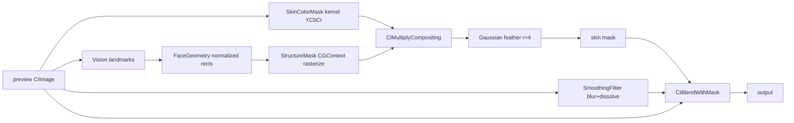

Here's the complete OpenSpec change set for Week 2 — skin-aware smoothing (color-mask kernel → landmark exclusions → masked blend). Same structure as Week 1, drop each file into your repo.

---

## File 1: `openspec/changes/add-skin-aware-smoothing/proposal.md`

```markdown
# Change: Add Skin-Aware Smoothing (Week 2)

## Why

Week 1's smoothing blurs the ENTIRE image — including eyes, eyebrows, lips,
backgrounds, and skin-colored walls. That reads as a cheap blur filter, not a
beautifier. The fix is targeting: detect faces, classify skin pixels, exclude
facial features, and apply smoothing only where it belongs. This is the
difference between "filter" and "retouch" and is the core value proposition
of the app.

## What Changes

- **NEW** `SkinKernels.ci.metal` — GPU kernel classifying skin pixels via
  YCbCr color thresholds (no ML model yet; that's Week 3).
- **NEW** Vision landmark pipeline: enlarged face box + bounding boxes for
  eyes, eyebrows, lips, converted to a normalized `FaceGeometry`.
- **NEW** `SkinMaskBuilder` — rasterizes face box (white) and feature
  exclusions (black) into a grayscale mask, multiplied with the color mask,
  feathered for invisible edges.
- **MODIFIED** `SmoothingFilter` — gains a `radius` parameter; radius now
  scales with detected face size.
- **NEW** `SkinSmoothing` — blur/dissolve result composited over the original
  via `CIBlendWithMask` using the skin mask.
- **NEW** UX: mask debug overlay toggle; slider disabled with a hint when no
  face is detected.
- **MODIFIED** Save path re-rasterizes the cached normalized geometry at full
  resolution.

## Impact

- **Affected specs:** `image-editing` (delta: 6 added requirements)
- **Affected code:** `Core/Filters` (kernel + masked chain), `Core/Face`
  (landmarks → geometry), `Features/Edit/EditViewModel` (pipeline swap)
- **Dependencies:** none new (CoreImage Metal kernels + Vision, both system)
- **Explicit limitation:** hands touching the face, and same-frame skin outside
  the face box, are handled imperfectly by color heuristics — resolved in
  Week 3 by a Core ML face-parsing model.
```

---

## File 2: `openspec/changes/add-skin-aware-smoothing/design.md`

```markdown
# Design — Skin-Aware Smoothing

## 1. Context

Week 1 shipped: import → global smoothing slider → compare → save.
This change inserts a targeting layer between image and filter:



## 2. Goals / Non-Goals

**Goals:** smoothing only on face skin; sharp eyes/brows/lips; feathered mask
edges; full-res save parity; ≤100 ms preview renders preserved.
**Non-goals:** ML segmentation (Week 3), tone grading (Week 3), live camera,
polygon-accurate feature shapes (boxes suffice — blur radius is small).

## 3. Coordinate Convention (read this first)

- Vision bounding boxes and landmark points are **normalized (0–1), origin
  bottom-left** — the SAME space as CIImage. **No Y-flipping anywhere** in the
  mask pipeline. Flipping is only ever needed when drawing onto SwiftUI
  (Week 1's overlay already solved that).
- `FaceGeometry` stores ONLY normalized rects → it can be rasterized at any
  resolution (preview now, full-res at save).

## 4. Decisions

### D7 — Skin color classification via CIColorKernel in a `.ci.metal` file
YCbCr skin clustering (classic CV result: Cb ≈ 0.30–0.51, Cr ≈ 0.52–0.70)
with soft edges via `smoothstep`. The filename suffix `.ci.metal` is REQUIRED —
Xcode compiles it into `default.cikernels` in the bundle.

```metal
// Core/Filters/SkinKernels.ci.metal  (EXACT filename)
#include <CoreImage/CoreImage.h>

extern "C" { namespace coreimage {

kernel vec4 skinColorMask(__sample color) {
    float cb = -0.169 * color.r - 0.331 * color.g + 0.500 * color.b + 0.5;
    float cr =  0.500 * color.r - 0.419 * color.g - 0.081 * color.b + 0.5;

    float s = smoothstep(0.30, 0.34, cb) * (1.0 - smoothstep(0.47, 0.51, cb))
            * smoothstep(0.52, 0.56, cr) * (1.0 - smoothstep(0.66, 0.70, cr));
    return vec4(s, s, s, 1.0);
}

}}
```

```swift
// Core/Filters/SkinColorMask.swift
enum SkinColorMask {
    private static let kernel: CIColorKernel = {
        let url = Bundle.main.url(forResource: "default",
                                  withExtension: "cikernels")!
        let data = try! Data(contentsOf: url)
        return try! CIColorKernel(functionName: "skinColorMask",
                                  fromMetalLibraryData: data)
    }()

    static func apply(to image: CIImage) -> CIImage {
        kernel.apply(extent: image.extent, arguments: [image]) ?? image
    }
}
```

### D8 — One geometry pass, cached, resolution-independent
Run `VNDetectFaceLandmarksRequest` ONCE per photo (background task at load).
Store normalized `FaceGeometry`. The mask is recomputed per frame is wasteful,
so ALSO cache the rasterized preview mask; rebuild only when the photo changes.
Save time rasterizes the same geometry at full-res size.

### D9 — Structure mask = rectangles in a CGContext, not polygons
Eyes/brows/lips are excluded by the bounding boxes of their landmark regions
(padded 20%) — accurate enough because blur radius is small and the color mask
already guards the edges. Rectangles are trivially implementable and debuggable.
The face box is Vision's bounding box enlarged asymmetrically to cover the
forehead (Vision boxes often crop it):

```swift
// Core/Face/FaceGeometry.swift
struct FaceGeometry {
    let faceBox: CGRect          // normalized, enlarged, bottom-left origin
    let exclusions: [CGRect]     // normalized rects: eyes, brows, lips
}

enum FaceGeometryBuilder {
    static func build(from observation: VNFaceObservation) -> FaceGeometry? {
        guard let lm = observation.landmarks else { return nil }

        var box = observation.boundingBox
        box.origin.x -= box.width * 0.15      // wider
        box.origin.y -= box.height * 0.10     // less below chin
        box.size.width *= 1.30
        box.size.height *= 1.40               // extra upward = forehead
        box = box.intersection(CGRect(x: 0, y: 0, width: 1, height: 1))

        let regions = [lm.leftEye, lm.rightEye, lm.leftEyebrow,
                       lm.rightEyebrow, lm.outerLips]
        let exclusions = regions.compactMap { region -> CGRect? in
            guard let region else { return nil }
            let r = boundingRect(of: region.normalizedPoints)
            return r.insetBy(dx: -r.width * 0.2, dy: -r.height * 0.2)
        }
        return FaceGeometry(faceBox: box, exclusions: exclusions)
    }

    private static func boundingRect(of points: [CGPoint]) -> CGRect {
        guard let minX = points.map(\.x).min(),
              let maxX = points.map(\.x).max(),
              let minY = points.map(\.y).min(),
              let maxY = points.map(\.y).max() else { return .zero }
        return CGRect(x: minX, y: minY, width: maxX - minX, height: maxY - minY)
    }
}
```

### D10 — Mask assembly: multiply, then feather
Color mask × structure mask via `CIMultiplyCompositing`, then a small
Gaussian blur (radius 4) for soft edges. Grayscale bitmap from CGContext is
valid mask input for `CIBlendWithMask`.

```swift
// Core/Filters/SkinMaskBuilder.swift
enum SkinMaskBuilder {
    static func rasterizeStructure(_ geo: FaceGeometry, size: CGSize) -> CIImage? {
        let w = Int(size.width), h = Int(size.height)
        guard let ctx = CGContext(data: nil, width: w, height: h,
                                  bitsPerComponent: 8, bytesPerRow: w,
                                  space: CGColorSpaceCreateDeviceGray(),
                                  bitmapInfo: CGImageAlphaInfo.none.rawValue)
        else { return nil }

        func px(_ r: CGRect) -> CGRect {
            CGRect(x: r.minX * size.width, y: r.minY * size.height,
                   width: r.width * size.width, height: r.height * size.height)
        }
        ctx.setFillColor(CGColor(gray: 0, alpha: 1))
        ctx.fill(CGRect(x: 0, y: 0, width: w, height: h))
        ctx.setFillColor(CGColor(gray: 1, alpha: 1))
        ctx.fill(px(geo.faceBox))
        ctx.setFillColor(CGColor(gray: 0, alpha: 1))
        geo.exclusions.forEach { ctx.fill(px($0)) }

        return ctx.makeImage().map(CIImage.init(cgImage:))
    }

    static func buildMask(for image: CIImage, geometry: FaceGeometry) -> CIImage {
        let color = SkinColorMask.apply(to: image)
        guard let structure = rasterizeStructure(geometry, size: image.extent.size)
        else { return color }
        let combined = color.applyingFilter(
            "CIMultiplyCompositing",
            parameters: [kCIInputBackgroundImageKey: structure])
        return combined.clampedToExtent()
            .applyingFilter("CIGaussianBlur", parameters: [kCIInputRadiusKey: 4])
            .cropped(to: image.extent)
    }
}
```

### D11 — Masked smoothing replaces global smoothing

```swift
// Core/Filters/SkinSmoothing.swift
enum SkinSmoothing {
    static func apply(to image: CIImage, mask: CIImage,
                      radius: CGFloat, amount: Float) -> CIImage {
        let softened = SmoothingFilter.apply(to: image, radius: radius, amount: amount)
        return softened.applyingFilter("CIBlendWithMask", parameters: [
            kCIInputBackgroundImageKey: image,
            kCIInputMaskImageKey: mask
        ])
    }
}
```
`SmoothingFilter.apply(to:amount:)` from Week 1 becomes
`apply(to:radius:amount:)` (single call site to update).

### D12 — Radius scales with face size; no-face = disabled
`radius = clamp(faceBox.width_px * 0.04, 4, 15)`. When Vision finds no face:
slider disabled, label "No face detected" shown, preview = original.
(Chosen over silently blurring everything — that would smooth backgrounds.)

## 5. Risks / Trade-offs

| Risk | Response |
|------|----------|
| Color mask misses dark skin in low light | Thresholds are conservative-soft (smoothstep); Week 3 ML parser removes this class of error. |
| Hands-on-face still smoothed | Accepted for MVP; documented limitation; ML parser fixes it. |
| Landmark boxes feel imprecise | Blur radii are small; verify with the mask debug overlay before "improving". |
| `.ci.metal` not compiling | Filename suffix MUST be `.ci.metal`; verify `default.cikernels` loads (task 1.4 fails loudly otherwise). |

## 6. Week 3 seams

`SkinColorMask` and `FaceGeometryBuilder` are both swappable behind
`SkinMaskBuilder.buildMask` — Week 3 replaces them with a Core ML face-parser
output + landmark-refined exclusions, with zero changes downstream.
```

---

## File 3: `openspec/changes/add-skin-aware-smoothing/specs/image-editing/spec.md`

```markdown
## ADDED Requirements

### Requirement: Skin-Only Smoothing
The system SHALL apply smoothing only to pixels classified as skin AND inside
a detected face region.

#### Scenario: Skin-colored background wall
- WHEN a photo contains a beige wall behind the subject
- AND the user sets smoothing above 0%
- THEN the wall SHALL remain pixel-identical to the original

### Requirement: Facial Feature Exclusion
The system SHALL NOT smooth eyes, eyebrows, or lips.

#### Scenario: Eyes retain sharpness
- WHEN smoothing is set to 100%
- THEN eye, eyebrow, and lip regions SHALL match the original within
  negligible blur (< 1px effective radius)

### Requirement: Feathered Mask Edges
The system SHALL blend masked smoothing such that no visible boundary exists
between smoothed and unsmoothed regions at 100% zoom-out.

### Requirement: Face-Relative Intensity
The system SHALL scale smoothing radius with detected face size, clamped to
4–15 px at preview resolution.

#### Scenario: Close-up face vs distant face
- GIVEN two photos, one face filling the frame and one face at 20% width
- WHEN the same slider value is applied
- THEN the close-up SHALL receive a proportionally larger radius

### Requirement: No-Face Behavior
WHEN no face is detected, the system SHALL disable the smoothing slider and
display a "No face detected" hint; the preview SHALL equal the original.

### Requirement: Full-Resolution Mask Parity
The system SHALL produce the saved full-resolution image using the same mask
geometry rasterized at full resolution (not an upscaled preview mask).
```

---

## File 4: `openspec/changes/add-skin-aware-smoothing/tasks.md`

```markdown
# Tasks — Skin-Aware Smoothing

> **Rules for the implementer (human or LLM):**
> 1. Complete tasks strictly in order. Each has a **Verify** step — pass it
>    before moving on.
> 2. Follow `design.md` code sketches EXACTLY. No renaming, no refactors
>    beyond what the task says.
> 3. Coordinate rule of the week: Vision and CIImage are BOTH bottom-left
>    origin. Never flip Y inside the mask pipeline. Only flip for SwiftUI display.
> 4. Commit after each section.

## §1 Skin Color Kernel

- [ ] **1.1** Create `Core/Filters/SkinKernels.ci.metal` — filename must end
  in exactly `.ci.metal` — with the exact kernel code from `design.md §D7`.
  - **Verify:** project builds with no errors.

- [ ] **1.2** Create `Core/Filters/SkinColorMask.swift` with the exact code
  from `design.md §D7`.
  - **Verify:** compiles.

- [ ] **1.3** Temporary sanity check: in `EditViewModel.load(data:)`, after
  `previewCI` exists, render `SkinColorMask.apply(to: previewCI)` to a UIImage
  and display it (replace the preview temporarily).
  - **Verify:** face/neck/hands appear WHITE, everything else near-BLACK.
    If the app crashes on bundle load, the `.ci.metal` file is misnamed or
    not in the target membership — fix before continuing.

- [ ] **1.4** Remove the temporary display code from 1.3.
  - **Verify:** app back to Week 1 behavior. Commit: `feat: skin color kernel`.

## §2 Face Geometry from Landmarks

- [ ] **2.1** Create `Core/Face/FaceGeometry.swift` containing the
  `FaceGeometry` struct and `FaceGeometryBuilder` — exact code from
  `design.md §D9`.
  - **Verify:** compiles.

- [ ] **2.2** Extend `Core/Face/FaceDetector.swift` with:
  ```swift
  static func detectGeometry(in cgImage: CGImage) -> FaceGeometry? {
      let request = VNDetectFaceLandmarksRequest()
      let handler = VNImageRequestHandler(cgImage: cgImage, options: [:])
      try? handler.perform([request])
      // pick the LARGEST face by bounding-box area
      guard let best = request.results?
          .max(by: { area($0) < area($1) }) else { return nil }
      return FaceGeometryBuilder.build(from: best)
  }
  private static func area(_ f: VNFaceObservation) -> CGFloat {
      f.boundingBox.width * f.boundingBox.height
  }
  ```
  - **Verify:** compiles.

- [ ] **2.3** Debug-verify geometry: temporarily draw the normalized
  `faceBox` (green) and each `exclusions` rect (red) over the preview using
  the Week 1 overlay approach (remember: flip Y for SwiftUI display).
  - **Verify:** green box covers face INCLUDING forehead; red boxes sit on
    both eyes, both eyebrows, and lips — on a portrait AND a landscape photo.
    Wrong positions usually mean an accidental Y-flip; fix before continuing.

- [ ] **2.4** Remove the debug drawing code from 2.3. Commit:
  `feat: face geometry from vision landmarks`.

## §3 Mask Assembly

- [ ] **3.1** Create `Core/Filters/SkinMaskBuilder.swift` with the exact code
  from `design.md §D10`.
  - **Verify:** compiles.

- [ ] **3.2** Temporary sanity check: in `load(data:)`, run detection →
  `SkinMaskBuilder.buildMask(for: previewCI, geometry:)` → display the mask.
  - **Verify:** face skin WHITE; eyes/brows/lips BLACK; background BLACK;
    edges visibly soft (not razor-sharp). If exclusions are filled white,
    check fill-color ordering in `rasterizeStructure`.

- [ ] **3.3** Remove the temporary display code. Commit:
  `feat: skin mask builder`.

## §4 Pipeline Integration

- [ ] **4.1** Refactor `SmoothingFilter.apply(to:amount:)` →
  `apply(to:radius:amount:)` (remove `static let radius`; use the parameter).
  Update the single existing call site.
  - **Verify:** builds; Week 1 behavior unchanged at radius 8.

- [ ] **4.2** Create `Core/Filters/SkinSmoothing.swift` — exact code from
  `design.md §D11`.
  - **Verify:** compiles.

- [ ] **4.3** Update `EditViewModel`:
  - Add `@Published var faceGeometry: FaceGeometry?`,
    `@Published var noFaceDetected = false`,
    `@Published var showMaskDebug = false`, and a private
    `previewMask: CIImage?`.
  - In `load(data:)`, after building `previewCI`: run detection in a
    background `Task` using the normalized UIImage's `cgImage`; store
    `faceGeometry`; build and store `previewMask`; set
    `noFaceDetected = (faceGeometry == nil)`; then call `renderPreview()`.
  - **Verify:** loading a portrait photo sets `faceGeometry` non-nil (print or
    breakpoint to confirm).

- [ ] **4.4** Rewrite `renderPreview()`:
  - If `showMaskDebug` → render `previewMask` (or black image if nil).
  - Else if `faceGeometry != nil` → compute
    `radius = min(max(faceBox.width * previewCI.extent.width * 0.04, 4), 15)`
    and render `SkinSmoothing.apply(to: previewCI, mask: previewMask!,
    radius: radius, amount: amount)`.
  - Else → render `previewCI` unchanged.
  - **Verify:** slider now smooths ONLY the face; eyes stay sharp; background
    unchanged (compare with long-press).

- [ ] **4.5** No-face UX: disable the slider when `noFaceDetected`
  (`.disabled(viewModel.noFaceDetected)`) and show the text
  "No face detected" above the slider.
  - **Verify:** test with a landscape photo containing no people: slider is
    greyed out, hint shows.

- [ ] **4.6** Mask debug toggle: add a small toolbar button toggling
  `showMaskDebug`; on toggle call `renderPreview()`.
  - **Verify:** toggle shows the grayscale mask live.

- [ ] **4.7** Save path parity: in `save()`, after decoding full-res CIImage,
  rasterize `SkinMaskBuilder.buildMask` at FULL-RES size from the cached
  `faceGeometry`, compute radius from full-res face width, and run
  `SkinSmoothing.apply` before saving.
  - **Verify:** saved image has the same targeting as the preview (eyes sharp)
    at full pixel dimensions.

- [ ] **4.8** Commit: `feat: skin-aware smoothing pipeline`.

## §5 Week 2 Acceptance

- [ ] **5.1** Manual test matrix on a PHYSICAL device:
  - [ ] close-up selfie: skin smooth, eyes/brows/lips sharp, no halo at face edge
  - [ ] photo with beige/skin-colored wall: wall untouched
  - [ ] photo with hand on cheek: note behavior (acceptable: partially smoothed)
  - [ ] landscape/rotated photo: mask positions still correct
  - [ ] group photo: only the LARGEST face smoothed (multi-face = Week 2 stretch)
  - [ ] no people: slider disabled + hint
  - [ ] slider at 0%: output pixel-identical to original (long-press compare)
  - [ ] saved full-res image matches preview targeting
  - [ ] slider drag still ≤ 100 ms latency

- [ ] **5.2** Update `docs/REQUIREMENTS.md`: append a "Week 2" section listing
  the six requirements from
  `specs/image-editing/spec.md`; tick each one verified in 5.1.

- [ ] **5.3** Tag the commit `v0.2.0-week2`.

## §6 STRETCH — Multi-Face Support

> Only if §1–§5 finished early.

- [ ] **6.1** Change `detectGeometry` to return `[FaceGeometry]` (all faces,
  not just the largest).
- [ ] **6.2** In `SkinMaskBuilder.rasterizeStructure`, draw ALL face boxes
  white and ALL exclusions black into the same context.
- [ ] **6.3** Radius: computed per face — use the LARGEST face's width for
  Week 2 (note the limitation in a code comment).
  - **Verify:** in a two-person photo, both faces are smoothed with correct
    feature exclusion.
```

---

**Execution order:** run `§1 → §4` through your coding LLM one section at a time (each section = one commit), do `§5` yourself on a real device — mask quality is a visual judgment a model can't make.

The deliberate Week 3 seams are in design §6: everything downstream of `buildMask` survives when you swap the color kernel for a Core ML face-parser — which is also when you'd finally touch PyTorch (or just convert the pretrained BiSeNet weights, per our earlier discussion). Want that Week 3 spec drafted now too?