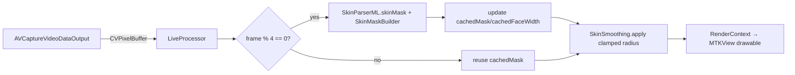

# Design — Live Camera Pipeline (v2)

## 1. Frame budget

`SkinParserML` (512×512, ANE) ≈ 5–10ms on device; too heavy for every frame
at 60fps combined with the blur chain. Faces move slowly: refresh the mask
every 4th frame (~15Hz), reuse for the 3 frames between. Imperceptible lag.



## 2. Key decisions

### D19 — Metal-backed preview
`MTKView` wrapped in `UIViewRepresentable`; `framebufferOnly = false`;
render each processed `CIImage` with the shared `RenderContext` CIContext
(created with the MTKView's `device` — add
`RenderContext.sharedFor(device:)` if needed). Never route frames through
`UIImageView`/SwiftUI `Image`.

### D20 — Temporal mask caching in `LiveProcessor`

```swift
final class LiveProcessor {
    private var cachedMask: CIImage?
    private var cachedFaceWidth: CGFloat = 0
    private var frameIndex = 0
    var amount: Float = 0.5

    func process(_ pixelBuffer: CVPixelBuffer) -> CIImage {
        let image = CIImage(cvPixelBuffer: pixelBuffer)
        frameIndex += 1
        if frameIndex % 4 == 0,
           let cg = RenderContext.shared.createCGImage(image, from: image.extent) {
            if let skin = SkinParserML.skinMask(for: cg) {
                cachedMask = SkinMaskBuilder.buildMask(for: image, skinMask: skin)
            }
            cachedFaceWidth = FaceDetector.faceWidth(in: cg) ?? cachedFaceWidth
        }
        guard let mask = cachedMask else { return image }   // warm-up frames
        let radius = min(max(cachedFaceWidth * image.extent.width * 0.04, 4),
                         15 * image.extent.width / 2048)
        return SkinSmoothing.apply(to: image, mask: mask, radius: radius, amount: amount)
    }
}
```

### D21 — Capture path reuses the editor
Shutter → `AVCapturePhotoOutput` → `Data` → push existing
`EditView(originalData:)`. One quality pipeline, one save path. No duplicate
filter logic.

### D22 — Session hygiene
Serial `sessionQueue`; `startRunning`/`stopRunning` only on that queue;
stop the session in `onDisappear` (camera LED off = trust).

## 3. Risks

| Risk | Response |
|------|----------|
| Simulator fps low (CPU ML) | Acceptable for dev; acceptance tests on device. |
| Mask lag on fast motion | 4-frame cache ≈ 66ms at 60fps; raise to every-2nd-frame on A15+. |
| Thermal on long sessions | Pause mask refresh when `ProcessInfo.thermalState` ≥ .serious. |
