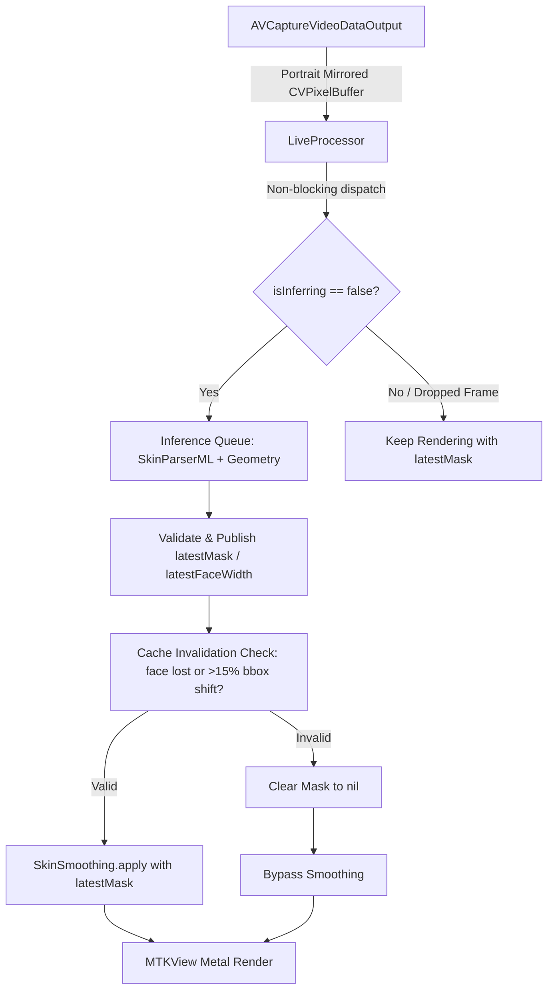

# Design — Live Camera Pipeline (v4)

## 1. Context & Objectives

Live beautification reusing the Week 3.5 BiSeNet Core ML semantic pipeline.
The static photo picker is deprecated; the live camera feed is the root scene.

- **Acceptance Target:** Real-time preview rendering at ≥30 fps on device (with 60 fps as stretch).
- **Inference Budget:** BiSeNet runs asynchronously on a dedicated serial inference queue (taking ~15–25ms on ANE), never blocking the 16.7ms/33.3ms Metal render loop.

## 2. Architecture & Concurrency



## 3. Decisions

### D1 — Asynchronous Non-Blocking Inference Queue
- Rendering runs strictly on the frame callback / `MTKViewDelegate`.
- `LiveProcessor` maintains a serial `DispatchQueue(label: "com.beautifier.inference", qos: .userInitiated)`.
- When a new frame arrives, if `isInferring == false`, the buffer is submitted to the inference queue. If inference is still running from a previous frame, intermediate frames simply reuse `latestMask` without waiting or dropping render frames.
- Rendering latency is bounded by the Metal shader pass (< 4ms).

### D2 — Deterministic AVFoundation Orientation & Mirroring
- In `AVCaptureVideoDataOutput`, configure the connection:
  - `connection.videoOrientation = .portrait` (or `videoRotationAngle = 90` on iOS 17+)
  - `connection.isVideoMirrored = true` (for front camera)
- `CVPixelBuffer` frames arrive in native portrait-mirrored BGRA format.
- Preview rendering, Vision face geometry, Core ML BiSeNet parsing, mask transforms, and still captures all share this exact unified coordinate system without ad-hoc orientation guessing.

### D3 — Cache Invalidation Rules
`latestMask` is invalidated (`nil` = unblurred pass-through) when:
1. Inference completes and detects no face or zero skin pixels (prevents ghost smoothing when a face exits frame).
2. Face bounding box centroid shifts by > 15% or area shifts by > 20% before the next inference finishes.
3. Camera device switches or application resumes from background.

### D4 — Bounded Radius Formula (Aligned with Week 3.5 Spec)
Radius strictly adheres to the 15px cap at 2048px scale:
```swift
let scale = frameWidth / 2048.0
let baseRadius = max(6.0 * scale, faceWidthRatio * frameWidth * 0.05)
let radius = min(baseRadius, 15.0 * scale)
```

### D5 — One Context, One Queue
Coordinator owns a single `MTLCommandQueue = device.makeCommandQueue()`.
All rendering uses `RenderContext.shared` (Metal-backed `CIContext`). No per-frame context/queue allocations.

### D6 — Aspect-Fill Viewport Scaling
```swift
let scale = max(drawableWidth / imageWidth, drawableHeight / imageHeight)
let scaledSize = CGSize(width: imageWidth * scale, height: imageHeight * scale)
let origin = CGPoint(x: (drawableWidth - scaledSize.width) / 2.0, y: (drawableHeight - scaledSize.height) / 2.0)
```
Renders centered aspect-fill without distortion.

### D7 — Capture Handoff
Shutter button triggers `AVCapturePhotoOutput` → returns full-res still `Data` → navigates to `EditView(originalData:)` for fine-tuning and saving.

### D8 — Lifecycle & Permission Management
- Serial capture queue handles `startRunning()` and `stopRunning()`.
- Capture session stops on `.onDisappear` and `scenePhase != .active`.
- If camera permission is denied or restricted, displays a clean non-crashing overlay with a direct button to Open iOS Settings.

## 4. Device Verification Metrics

| Metric | Target | Method |
|---|---|---|
| **Render Frame Rate** | ≥30.0 FPS (avg duration ≤ 33.3ms) | Timestamp delta rolling average over 120 frames |
| **Inference Latency** | ≤ 35ms / cycle on ANE | `os_signpost` / CFAbsoluteTime on inference queue |
| **Lifecycle State** | Camera LED turns off immediately on background | `scenePhase` transition test |
| **Memory Ceiling** | < 120MB active footprint | Xcode Memory Gauge / Instruments |
