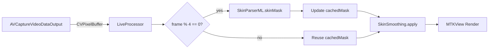

# Design — Live Camera Pipeline

## 1. Context & Constraints

Processing a live camera feed requires balancing high visual quality with strict frame budgets (16ms for 60fps). 
Running the `SkinParserML` (BiSeNet) model takes ~15-25ms on the Neural Engine. Running it on *every* frame will cause dropped frames and jank.

**The Solution:** Temporal Caching. We run the heavy ML inference on a low-frequency timer (e.g., every 4th frame), and reuse the cached mask for the frames in between. Faces don't move wildly in 60ms, so a slightly stale mask is imperceptible to the user.

## 2. Architecture

## 3. Key Decisions

### D1 — Metal-backed preview (`MTKView`)
Rendering `CIImage` to a standard SwiftUI `Image` 60 times a second causes massive CPU overhead. We must render the `CIImage` directly to a Metal drawable. We will wrap `MTKView` in a `UIViewRepresentable`.

### D2 — Temporal Mask Caching in `LiveProcessor`
The processor maintains a `cachedMask: CIImage?` and a `frameCount: Int`.
- If `frameCount % 4 == 0`, run `SkinParserML` on the current frame, update `cachedMask`.
- For all frames, apply `SkinSmoothing.apply` using the `cachedMask`.

### D3 — Camera Mirror
The front camera feed must be horizontally mirrored (`connection.isVideoMirrored = true`) so it behaves like a standard mirror for the user.
