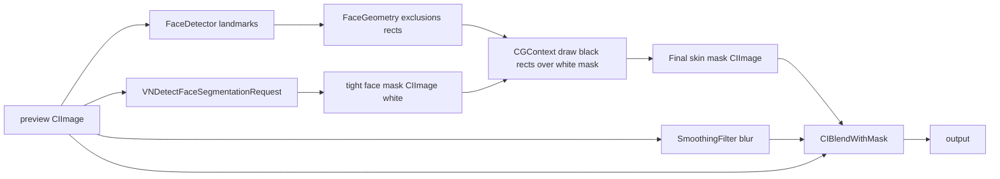

# Design — AI Skin Segmentation

## 1. Context & Constraints

Week 2 shipped a heuristic color mask. This change replaces it with a
hardware-accelerated AI mask. We are intentionally *not* training a custom
PyTorch model (like BiSeNet) because Apple's built-in
`VNDetectFaceSegmentationRequest` is already a state-of-the-art Core ML model
running on the Neural Engine. It is faster, requires zero Python/ML setup,
and integrates perfectly with the Vision framework.

## 2. Goals / Non-Goals

**Goals:** tight face mask (no background/hair); eyes/lips excluded; pure
Swift implementation; delete `SkinColorMask.swift`.
**Non-goals:** custom Core ML model training, multi-face segmentation (Week 4).

## 3. Architecture



## 4. Decisions

### D13 — Use `VNDetectFaceSegmentationRequest` for the tight mask
This request outputs a single-channel (grayscale) mask where white = face,
black = background. It is hardware-accelerated and runs in <10ms on modern
iPhones.

```swift
// Core/Face/FaceSegmenter.swift
import Vision

enum FaceSegmenter {
    static func segmentFace(in cgImage: CGImage) -> CIImage? {
        let request = VNDetectFaceSegmentationRequest()
        let handler = VNImageRequestHandler(cgImage: cgImage, options: [:])
        try? handler.perform([request])
        
        guard let observation = request.results?.first else { return nil }
        
        // Convert the single-channel pixel buffer to a CIImage
        let mask = CIImage(cvPixelBuffer: observation.pixelBuffer)
        return mask
    }
}
```

### D14 — Replace `SkinMaskBuilder.buildMask` logic
We no longer need `SkinColorMask.apply(to:)`. We get the tight mask from
`FaceSegmenter`, scale it to match the preview CIImage extent (because the
Vision request might return a smaller pixel buffer), and multiply it by
the structure mask (exclusions drawn in black).

```swift
// Core/Filters/SkinMaskBuilder.swift
static func buildMask(for image: CIImage, geometry: FaceGeometry, 
                      faceMask: CIImage) -> CIImage {
    // 1. Scale the AI mask to match the image extent
    let scaleX = image.extent.width / faceMask.extent.width
    let scaleY = image.extent.height / faceMask.extent.height
    let scaledMask = faceMask.transformed(by: CGAffineTransform(scaleX: scaleX, y: scaleY))
    
    // 2. Rasterize structure (exclusions drawn black over white background)
    guard let structure = rasterizeStructure(geometry, size: image.extent.size) 
    else { return scaledMask }
    
    // 3. Multiply: AI mask * Structure mask
    let combined = scaledMask.applyingFilter(
        "CIMultiplyCompositing",
        parameters: [kCIInputBackgroundImageKey: structure])
        
    // 4. Feather edges
    return combined.clampedToExtent()
        .applyingFilter("CIGaussianBlur", parameters: [kCIInputRadiusKey: 4])
        .cropped(to: image.extent)
}
```

### D15 — Update `FaceGeometry.rasterizeStructure`
Since the AI mask already provides the tight face boundary, we no longer
need to draw the `faceBox` (white rectangle) in the CGContext. We fill the
background with white and only draw the `exclusions` (eyes, brows, lips) in black.

```swift
// In rasterizeStructure:
ctx.setFillColor(CGColor(gray: 1, alpha: 1))   // Start white background
ctx.fill(CGRect(x: 0, y: 0, width: w, height: h))
ctx.setFillColor(CGColor(gray: 0, alpha: 1))   // Draw exclusions black
geo.exclusions.forEach { ctx.fill(px($0)) }
```

## 5. Risks / Trade-offs

| Risk | Response |
|------|----------|
| `VNDetectFaceSegmentationRequest` is slow | It runs on the Neural Engine; usually <10ms. If slow, cache the mask like we did in Week 2. |
| Mask edges are jagged | The 4px Gaussian blur feathering in `buildMask` handles this. |
