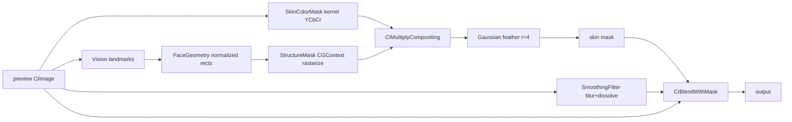

# Design — Skin-Aware Smoothing

## 1. Context

Week 1 shipped: import → global smoothing slider → compare → save.
This change inserts a targeting layer between image and filter:



## 2. Goals / Non-Goals

**Goals:** smoothing only on face skin; sharp eyes/brows/lips; feathered mask
edges; full-res save parity; ≤100 ms preview renders preserved.
**Non-goals:** ML segmentation (Week 3), tone grading (Week 3), live camera,
polygon-accurate feature shapes (boxes suffice — blur radius is small).

## 3. Coordinate Convention (read this first)

- Vision bounding boxes and landmark points are **normalized (0–1), origin
  bottom-left** — the SAME space as CIImage. **No Y-flipping anywhere** in the
  mask pipeline. Flipping is only ever needed when drawing onto SwiftUI
  (Week 1's overlay already solved that).
- `FaceGeometry` stores ONLY normalized rects → it can be rasterized at any
  resolution (preview now, full-res at save).

## 4. Decisions

### D7 — Skin color classification via CIColorKernel in a `.ci.metal` file
YCbCr skin clustering (classic CV result: Cb ≈ 0.30–0.51, Cr ≈ 0.52–0.70)
with soft edges via `smoothstep`. The filename suffix `.ci.metal` is REQUIRED —
Xcode compiles it into `default.cikernels` in the bundle.

```metal
// Core/Filters/SkinKernels.ci.metal  (EXACT filename)
#include <CoreImage/CoreImage.h>

extern "C" { namespace coreimage {

kernel vec4 skinColorMask(__sample color) {
    float cb = -0.169 * color.r - 0.331 * color.g + 0.500 * color.b + 0.5;
    float cr =  0.500 * color.r - 0.419 * color.g - 0.081 * color.b + 0.5;

    float s = smoothstep(0.30, 0.34, cb) * (1.0 - smoothstep(0.47, 0.51, cb))
            * smoothstep(0.52, 0.56, cr) * (1.0 - smoothstep(0.66, 0.70, cr));
    return vec4(s, s, s, 1.0);
}

}}
```

```swift
// Core/Filters/SkinColorMask.swift
enum SkinColorMask {
    private static let kernel: CIColorKernel = {
        let url = Bundle.main.url(forResource: "default",
                                  withExtension: "cikernels")!
        let data = try! Data(contentsOf: url)
        return try! CIColorKernel(functionName: "skinColorMask",
                                  fromMetalLibraryData: data)
    }()

    static func apply(to image: CIImage) -> CIImage {
        kernel.apply(extent: image.extent, arguments: [image]) ?? image
    }
}
```

### D8 — One geometry pass, cached, resolution-independent
Run `VNDetectFaceLandmarksRequest` ONCE per photo (background task at load).
Store normalized `FaceGeometry`. Recomputing the mask per frame is wasteful,
so ALSO cache the rasterized preview mask; rebuild only when the photo changes.
Save time rasterizes the same geometry at full-res size.

### D9 — Structure mask = rectangles in a CGContext, not polygons
Eyes/brows/lips are excluded by the bounding boxes of their landmark regions
(padded 20%) — accurate enough because blur radius is small and the color mask
already guards the edges. Rectangles are trivially implementable and debuggable.
The face box is Vision's bounding box enlarged asymmetrically to cover the
forehead (Vision boxes often crop it):

```swift
// Core/Face/FaceGeometry.swift
struct FaceGeometry {
    let faceBox: CGRect          // normalized, enlarged, bottom-left origin
    let exclusions: [CGRect]     // normalized rects: eyes, brows, lips
}

enum FaceGeometryBuilder {
    static func build(from observation: VNFaceObservation) -> FaceGeometry? {
        guard let lm = observation.landmarks else { return nil }

        var box = observation.boundingBox
        box.origin.x -= box.width * 0.15      // wider
        box.origin.y -= box.height * 0.10     // less below chin
        box.size.width *= 1.30
        box.size.height *= 1.40               // extra upward = forehead
        box = box.intersection(CGRect(x: 0, y: 0, width: 1, height: 1))

        let regions = [lm.leftEye, lm.rightEye, lm.leftEyebrow,
                       lm.rightEyebrow, lm.outerLips]
        let exclusions = regions.compactMap { region -> CGRect? in
            guard let region else { return nil }
            let r = boundingRect(of: region.normalizedPoints)
            return r.insetBy(dx: -r.width * 0.2, dy: -r.height * 0.2)
        }
        return FaceGeometry(faceBox: box, exclusions: exclusions)
    }

    private static func boundingRect(of points: [CGPoint]) -> CGRect {
        guard let minX = points.map(\.x).min(),
              let maxX = points.map(\.x).max(),
              let minY = points.map(\.y).min(),
              let maxY = points.map(\.y).max() else { return .zero }
        return CGRect(x: minX, y: minY, width: maxX - minX, height: maxY - minY)
    }
}
```

### D10 — Mask assembly: multiply, then feather
Color mask × structure mask via `CIMultiplyCompositing`, then a small
Gaussian blur (radius 4) for soft edges. Grayscale bitmap from CGContext is
valid mask input for `CIBlendWithMask`.

```swift
// Core/Filters/SkinMaskBuilder.swift
enum SkinMaskBuilder {
    static func rasterizeStructure(_ geo: FaceGeometry, size: CGSize) -> CIImage? {
        let w = Int(size.width), h = Int(size.height)
        guard let ctx = CGContext(data: nil, width: w, height: h,
                                  bitsPerComponent: 8, bytesPerRow: w,
                                  space: CGColorSpaceCreateDeviceGray(),
                                  bitmapInfo: CGImageAlphaInfo.none.rawValue)
        else { return nil }

        func px(_ r: CGRect) -> CGRect {
            CGRect(x: r.minX * size.width, y: r.minY * size.height,
                   width: r.width * size.width, height: r.height * size.height)
        }
        ctx.setFillColor(CGColor(gray: 0, alpha: 1))
        ctx.fill(CGRect(x: 0, y: 0, width: w, height: h))
        ctx.setFillColor(CGColor(gray: 1, alpha: 1))
        ctx.fill(px(geo.faceBox))
        ctx.setFillColor(CGColor(gray: 0, alpha: 1))
        geo.exclusions.forEach { ctx.fill(px($0)) }

        return ctx.makeImage().map(CIImage.init(cgImage:))
    }

    static func buildMask(for image: CIImage, geometry: FaceGeometry) -> CIImage {
        let color = SkinColorMask.apply(to: image)
        guard let structure = rasterizeStructure(geometry, size: image.extent.size)
        else { return color }
        let combined = color.applyingFilter(
            "CIMultiplyCompositing",
            parameters: [kCIInputBackgroundImageKey: structure])
        return combined.clampedToExtent()
            .applyingFilter("CIGaussianBlur", parameters: [kCIInputRadiusKey: 4])
            .cropped(to: image.extent)
    }
}
```

### D11 — Masked smoothing replaces global smoothing

```swift
// Core/Filters/SkinSmoothing.swift
enum SkinSmoothing {
    static func apply(to image: CIImage, mask: CIImage,
                      radius: CGFloat, amount: Float) -> CIImage {
        let softened = SmoothingFilter.apply(to: image, radius: radius, amount: amount)
        return softened.applyingFilter("CIBlendWithMask", parameters: [
            kCIInputBackgroundImageKey: image,
            kCIInputMaskImageKey: mask
        ])
    }
}
```
`SmoothingFilter.apply(to:amount:)` from Week 1 becomes
`apply(to:radius:amount:)` (single call site to update).

### D12 — Radius scales with face size; no-face = disabled
`radius = clamp(faceBox.width_px * 0.04, 4, 15)`. When Vision finds no face:
slider disabled, label "No face detected" shown, preview = original.

## 5. Risks / Trade-offs

| Risk | Response |
|------|----------|
| Color mask misses dark skin in low light | Thresholds are conservative-soft (smoothstep); Week 3 ML parser removes this class of error. |
| Hands-on-face still smoothed | Accepted for MVP; documented limitation; ML parser fixes it. |
| Landmark boxes feel imprecise | Blur radii are small; verify with the mask debug overlay before "improving". |
| `.ci.metal` not compiling | Filename suffix MUST be `.ci.metal`; verify `default.cikernels` loads (task 1.4 fails loudly otherwise). |

## 6. Week 3 seams

`SkinColorMask` and `FaceGeometryBuilder` are both swappable behind
`SkinMaskBuilder.buildMask` — Week 3 replaces them with a Core ML face-parser
output + landmark-refined exclusions, with zero changes downstream.
