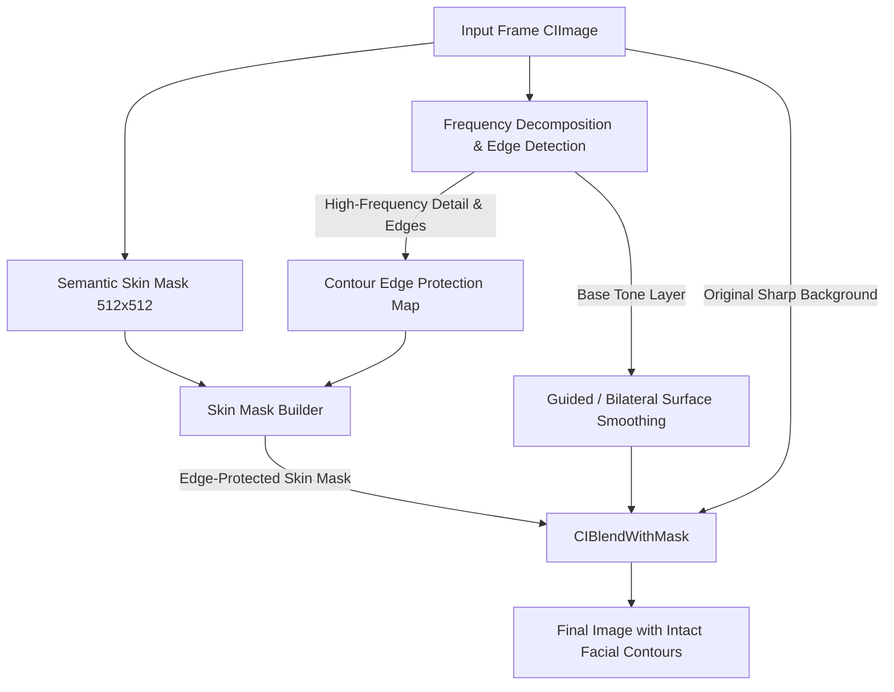

# Design: Edge-Preserving Skin Smoothing and Facial Contour Preservation

## Architecture Overview

## Technical Decisions

### D1: Frequency Separation & Edge-Preserving Filter
- Instead of blurring all frequencies equally, `SmoothingFilter` decomposes the input image into:
  - **Base Layer (Low/Mid Frequencies)**: Captures skin tone gradients, acne, blemishes, and discoloration.
  - **Detail Layer (High Frequencies & Sharp Edges)**: Captures facial contour lines (jawline, eyelids, nose ridge, lips).
- In Core Image / Metal:
  - We use bilateral/guided surface smoothing or frequency-separated detail recombining:
    $$\text{Detail} = I - \text{Blur}(I)$$
    $$\text{SmoothedBase} = \text{SurfaceSmooth}(I, \text{radius})$$
    $$I_{\text{smooth}} = \text{Mix}(I, \text{SmoothedBase} + \alpha \cdot \text{Detail}, \text{amount})$$
  - Where $\alpha \in [0.4, 0.7]$ retains fine structural lines and edge contours while smoothing the underlying uneven complexion.

### D2: Contour Edge Suppression Mask
- Extract high-contrast luminance gradients via `CIEdges` or luminance gradient filter from the input image.
- Multiply the inverted edge map with the semantic skin mask:
  $$M_{\text{protected}} = M_{\text{skin}} \times \text{clamp}(1.0 - \beta \cdot G_{\text{edges}}, 0.0, 1.0)$$
- This automatically creates a soft protective shield around:
  - The jawline boundary against the neck / background
  - The shadows and bridge lines of the nose
  - The eyelid creases and orbital sockets
  - The philtrum and lip vermilion borders

### D3: GPU Performance Guarantee
- All filter steps are chained directly into Core Image's Metal execution graph (`RenderContext.shared`).
- Runs in $< 1.8\text{ms}$ per frame on Apple Silicon GPUs (iPhone 11 through iPhone 17 series), easily maintaining 60 FPS in live camera preview.
