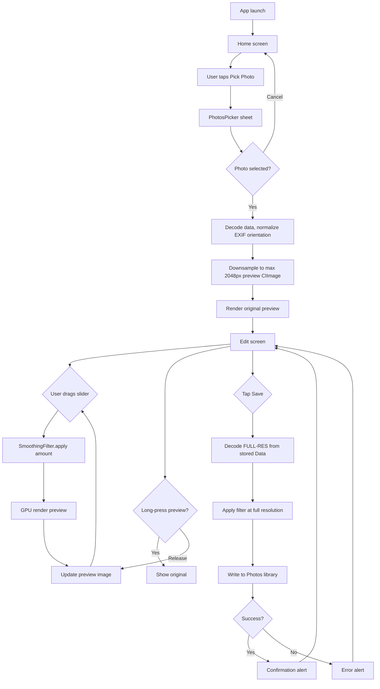

Here's the complete Week 1 documentation set. Copy each block into your repo at the path shown.

---

## File 1: `docs/REQUIREMENTS.md`

```markdown
# Beautify — Week 1 MVP Requirements

**Version:** 0.1 · **Target:** 1 developer, 1 week · **Platform:** iOS 17+, iPhone

## 1. Goal

Ship the end-to-end image pipeline of a beautifier app:
import photo → apply skin smoothing with adjustable intensity → compare → save.

Week 1 proves the pipeline. Skin-aware masking, tone grading, and camera support
come in Week 2+.

## 2. Non-Goals (explicitly out of scope for Week 1)

- Skin segmentation / ML models
- Eye, lip, or landmark-aware editing
- Color/tone enhancement, LUTs, presets
- Live camera
- Undo history, multiple filters, social sharing

## 3. User Stories

| ID | Story |
|----|-------|
| US-1 | As a user, I pick a photo from my library and see it in the editor. |
| US-2 | As a user, I drag a slider and watch my skin smooth in real time. |
| US-3 | As a user, I long-press the preview to compare against the original. |
| US-4 | As a user, I save the full-resolution result to my Photos library. |

## 4. Functional Requirements

| ID | Requirement |
|----|-------------|
| FR-1 | Import one photo via `PhotosPicker` (no library permission needed to pick). |
| FR-2 | Display the photo fitted to screen, preserving aspect ratio. |
| FR-3 | A slider (0–100%) controls smoothing intensity. Preview updates while dragging. |
| FR-4 | Live preview renders from an image downscaled to max dimension 2048 px. |
| FR-5 | Long-pressing the preview shows the original; releasing shows the edit. |
| FR-6 | Save renders the effect at FULL original resolution and writes to Photos (add-only access). |
| FR-7 | Photos with any EXIF orientation (portrait/landscape/rotated) display and edit correctly. |
| FR-8 | Save failure or denied permission shows a non-blocking alert. |
| FR-9 | (STRETCH) Detect faces with Vision and draw debug bounding boxes. |

## 5. Non-Functional Requirements

| ID | Requirement |
|----|-------------|
| NFR-1 | Slider drag re-renders in ≤ 100 ms on an A14 or newer device. |
| NFR-2 | No memory crash when importing a 48 MP photo (downsample-for-preview strategy). |
| NFR-3 | Pipeline architecture must allow adding a skin mask and tone filters in Week 2 without rework. |
| NFR-4 | One shared `CIContext` for the app lifetime (never create per-render). |

## 6. Edit Flow — Activity Diagram



## 7. Definition of Done — Week 1

- [ ] FR-1 … FR-8 pass on a physical device.
- [ ] Tested with: portrait photo, landscape photo, rotated photo, one 40+ MP photo.
- [ ] Slider feels smooth while dragging (NFR-1).
- [ ] Code committed and tagged `v0.1.0-week1`.

## 8. Risks

| Risk | Mitigation |
|------|------------|
| EXIF orientation bugs (classic iOS trap) | Normalize orientation at decode time (design §D2). |
| Memory spike on huge photos | Preview is always downsampled; full-res decoded only at save, then released. |
| CIContext created repeatedly → jank | Enforced singleton (design §D1). |
| Blur looks "plastic" | Amount blends original↔blurred (design §D4); masked smoothing arrives Week 2. |
```

---

## File 2: `openspec/changes/add-core-beautifier-mvp/proposal.md`

```markdown
# Change: Add Core Beautifier MVP (Week 1)

## Why

The product is a face beautifier, but before any ML can matter we need a
correct, fast, extensible image pipeline: import → process on GPU → preview →
save at full resolution. Week 1 delivers that pipeline with one visible effect
(skin smoothing via controlled blur) so every later feature (skin mask, tone,
camera) plugs into existing plumbing instead of triggering rewrites.

## What Changes

- **NEW** SwiftUI app shell: Home screen with `PhotosPicker`, Edit screen.
- **NEW** Rendering core: shared Metal-backed `CIContext`, orientation
  normalization, Lanczos downsampling for previews, add-only Photos saving.
- **NEW** `SmoothingFilter`: Gaussian blur blended with the original by an
  intensity slider (Core Image, GPU).
- **NEW** Long-press before/after comparison.
- **NEW (stretch)** Vision face-rectangle detection with a debug overlay,
  preparing the ground for Week 2 landmark work.

## Impact

- **Affected specs:** `image-editing` (new capability)
- **Affected code:** brand-new app target; `Core/Rendering`, `Core/Filters`,
  `Features/Home`, `Features/Edit`, `Core/Face`
- **Permissions:** add-only Photos usage description (`NSPhotoLibraryAddUsageDescription`)
- **Dependencies:** none beyond system frameworks
  (SwiftUI, PhotosUI, CoreImage, Vision, Metal)
```

---

## File 3: `openspec/changes/add-core-beautifier-mvp/design.md`

```markdown
# Design — Core Beautifier MVP

## 1. Context & Constraints

- Solo developer, 1 week, learning while building.
- Must run in real time on GPU; must not crash on 48 MP inputs.
- Architecture must absorb Week 2 (skin mask + tone filters) without rework.

## 2. Goals / Non-Goals

**Goals:** working import→edit→save pipeline; one visible effect; clean seams
for later filters; sub-100 ms preview updates.
**Non-goals:** ML models, masking, camera, presets.

## 3. Architecture

```
Beautify/
├── BeautifyApp.swift
├── Features/
│   ├── Home/HomeView.swift          // PhotosPicker entry point
│   └── Edit/
│       ├── EditView.swift           // preview + controls
│       └── EditViewModel.swift      // state + render orchestration
└── Core/
    ├── Rendering/
    │   ├── RenderContext.swift      // CIContext singleton
    │   ├── ImageLoader.swift        // decode, normalize, downsample
    │   └── ImageSaver.swift         // add-only save to Photos
    ├── Filters/SmoothingFilter.swift
    └── Face/FaceDetector.swift      // stretch only
```

Data flow: `Data → UIImage (normalized) → CIImage (downsampled preview)
→ filter chain → CIContext.createCGImage → UIImage → SwiftUI Image`.
The view model stores the ORIGINAL `Data` (small) + the preview `CIImage`;
full-res decoding happens only at save time, then is released.

## 4. Key Decisions

### D1 — One shared Metal-backed CIContext
Creating a CIContext is expensive; per-render creation causes visible jank.

```swift
// RenderContext.swift
import CoreImage
import Metal

enum RenderContext {
    static let shared: CIContext = {
        let device = MTLCreateSystemDefaultDevice()!
        return CIContext(mtlDevice: device,
                         options: [.cacheIntermediates: false])
    }()
}
```

### D2 — Normalize EXIF orientation at decode time
`UIImage` carries orientation metadata; `CIImage` ignores it. Rotated photos
break every downstream coordinate calculation. Fix once, here:

```swift
// ImageLoader.swift
extension UIImage {
    func normalizedOrientation() -> UIImage {
        guard imageOrientation != .up else { return self }
        let format = UIGraphicsImageRendererFormat.default()
        format.scale = scale
        return UIGraphicsImageRenderer(size: size, format: format)
            .image { _ in draw(in: CGRect(origin: .zero, size: size)) }
    }
}
```

### D3 — Downsample for preview, full-res only on save (memory safety)
Preview is Lanczos-scaled to max dimension 2048:

```swift
func downsampled(_ image: CIImage, maxDimension: CGFloat) -> CIImage {
    let largest = max(image.extent.width, image.extent.height)
    guard largest > maxDimension else { return image }
    let scale = maxDimension / largest
    return image.applyingFilter("CILanczosScaleTransform",
                                parameters: [kCIInputScaleKey: scale])
}
```

### D4 — Smoothing = blur blended with original by intensity
Pure blur looks plastic. Blending original↔blurred by `amount` keeps some
texture and gives the slider a natural 0–100% feel. `clampedToExtent()`
prevents dark edge halos from the blur; we crop back afterwards.

```swift
// SmoothingFilter.swift
enum SmoothingFilter {
    static let radius: CGFloat = 8   // fixed for Week 1

    static func apply(to input: CIImage, amount: Float) -> CIImage {
        guard amount > 0 else { return input }
        let blurred = input
            .clampedToExtent()
            .applyingFilter("CIGaussianBlur",
                            parameters: [kCIInputRadiusKey: radius])
            .cropped(to: input.extent)
        // CIDissolveTransition linearly mixes: time 0 = original, 1 = blurred
        return input.applyingFilter("CIDissolveTransition", parameters: [
            kCIInputTargetImageKey: blurred,
            kCIInputTimeKey: amount
        ])
    }
}
```

### D5 — PhotosPicker for import, add-only for save
`PhotosPicker` needs no permission prompt. Saving uses
`UIImageWriteToSavedPhotosAlbum` (or PHPhotoLibrary add-only) which requires
only `NSPhotoLibraryAddUsageDescription`.

### D6 — Rendering off the main actor
Preview renders run in a background `Task`; the result is published back to
the UI. Slider changes cancel any in-flight render task (latest wins).

## 5. Week 2 seams (why this shape)

- Filters are pure functions `CIImage → CIImage` → Week 2 chains a
  `CIBlendWithMask` after `SmoothingFilter` with no API change.
- `Core/Face/` exists already → Vision landmark work drops in.
- Preview/full-res split is already solved → live camera reuses it.

## 6. Risks / Trade-offs

| Risk | Response |
|------|----------|
| Blur radius feels weak/strong on different faces | Fixed radius 8 is deliberate for Week 1; Week 2 scales radius by detected face size. |
| `CIDissolveTransition` is a "trick" for mixing | Documented; swap for a `CIMix` custom kernel only if needed. |
| 48 MP save is slow (~1–2 s) | Acceptable; show an in-progress state on the Save button. |
```

---

## File 4: `openspec/changes/add-core-beautifier-mvp/tasks.md`

```markdown
# Tasks — Core Beautifier MVP

> **Rules for the implementer (human or LLM):**
> 1. Complete tasks strictly in order. Do not skip or reorder.
> 2. Each task has a **Verify** step. Do not start the next task until it passes.
> 3. Follow `design.md` code sketches exactly. Do not refactor, rename, or
>    "improve" anything outside the current task.
> 4. Commit after each completed section (§1, §2, …).

## §1 Project Scaffolding

- [ ] **1.1** Create a new Xcode project.
  - Template: iOS App · Interface: SwiftUI · Language: Swift
  - Product Name: `Beautify` · Minimum Deployments: iOS 17.0
  - Uncheck "Include Tests".
  - **Verify:** app builds and runs in the simulator showing the default view.

- [ ] **1.2** Create this exact folder structure (empty groups):
  `Features/Home`, `Features/Edit`, `Core/Rendering`, `Core/Filters`, `Core/Face`.
  - **Verify:** folders visible in the project navigator; app still builds.

- [ ] **1.3** Add the save-permission key to `Info.plist`:
  - Key: `NSPhotoLibraryAddUsageDescription`
  - Value: `Beautify saves your edited photos to your library.`
  - **Verify:** key visible in the Info tab; app still builds.

- [ ] **1.4** Commit: `chore: scaffold project structure`.

## §2 Rendering Core

- [ ] **2.1** Create `Core/Rendering/RenderContext.swift` with the exact code
  from `design.md §D1`.
  - **Verify:** file compiles.

- [ ] **2.2** Create `Core/Rendering/ImageLoader.swift` containing:
  - the `UIImage.normalizedOrientation()` extension — exact code from `design.md §D2`
  - `func makePreviewCIImage(from data: Data, maxDimension: CGFloat = 2048) -> CIImage?`
    Steps inside: `UIImage(data:)` → `normalizedOrientation()` → `CIImage(image:)`
    → `downsampled(_:maxDimension:)`.
  - `func downsampled(_ image: CIImage, maxDimension: CGFloat) -> CIImage` —
    exact code from `design.md §D3`.
  - **Verify:** file compiles. Add a temporary `print(ciImage.extent)` in the
    Home screen after loading (remove in task 4.3) to confirm extent ≤ 2048.

- [ ] **2.3** Create `Core/Rendering/ImageSaver.swift`:
  ```swift
  enum ImageSaver {
      static func save(_ image: UIImage,
                       completion: @escaping (Error?) -> Void) {
          UIImageWriteToSavedPhotosAlbum(image, nil, nil, nil)
          completion(nil)
      }
  }
  ```
  (Synchronous variant is acceptable for Week 1; the permission alert is
  system-provided.)
  - **Verify:** file compiles.

- [ ] **2.4** Commit: `feat: rendering core (context, loader, saver)`.

## §3 Smoothing Filter

- [ ] **3.1** Create `Core/Filters/SmoothingFilter.swift` with the exact code
  from `design.md §D4`.
  - **Verify:** file compiles.

- [ ] **3.2** Temporary sanity check (delete after): in `BeautifyApp`'s
  ContentView `onAppear`, load any bundled sample image as CIImage, call
  `SmoothingFilter.apply(to:amount: 1.0)`, render to CGImage via
  `RenderContext.shared.createCGImage(_:from:)`, display it.
  - **Verify:** the displayed image is visibly blurred. Remove this test code.

- [ ] **3.3** Commit: `feat: smoothing filter`.

## §4 Home Screen & Photo Import (FR-1)

- [ ] **4.1** Create `Features/Edit/EditViewModel.swift`:
  ```swift
  @MainActor
  final class EditViewModel: ObservableObject {
      @Published var originalData: Data?          // kept for full-res save
      @Published var previewCI: CIImage?          // downsampled base image
      @Published var previewImage: UIImage?       // what the UI shows
      @Published var amount: Float = 0.5
      @Published var showingOriginal = false
      @Published var alert: AlertState?

      private var renderTask: Task<Void, Never>?
      // methods implemented in later tasks: load(data:), renderPreview(), save()
  }
  ```
  - **Verify:** compiles.

- [ ] **4.2** Create `Features/Home/HomeView.swift`:
  - A `PhotosPicker(selection:)` bound to a local `@State var item: PhotosPickerItem?`
    (import `PhotosUI`).
  - `.onChange(of: item)`: load `Data` via `item.loadTransferable(type: Data.self)`,
    then set `viewModel.originalData = data` and navigate to `EditView`.
  - **Verify:** picking a photo transitions to the (still empty) EditView.

- [ ] **4.3** Implement `EditViewModel.load(data:)`:
  store `originalData`, build `previewCI` via `makePreviewCIImage(from:)`,
  then set `previewImage` by rendering the UNFILTERED preview
  (`RenderContext.shared.createCGImage`). Delete any temporary prints from 2.2.
  - **Verify:** selected photo displays correctly for portrait AND landscape
    photos (orientation test — FR-7).

- [ ] **4.4** Commit: `feat: photo import and home screen`.

## §5 Edit Screen (FR-2 … FR-6)

- [ ] **5.1** Build `Features/Edit/EditView.swift` layout:
  - `GeometryReader` + `Image` showing `viewModel.previewImage`,
    `.resizable().scaledToFit()`.
  - Bottom bar containing: slider (0...1, bound to `viewModel.amount`),
    Save button.
  - **Verify:** layout renders with the imported photo.

- [ ] **5.2** Implement `EditViewModel.renderPreview()`:
  - Cancel previous `renderTask`; start a new background `Task`.
  - Inside: `SmoothingFilter.apply(to: previewCI!, amount: amount)` →
    `createCGImage` → wrap in `UIImage` → publish on MainActor
    (skip the filter when `showingOriginal == true` or `amount == 0`).
  - **Verify:** setting `amount` programmatically in `load(data:)` to 1.0
    shows a blurred preview.

- [ ] **5.3** Wire the slider: `.onChange(of: viewModel.amount)` calls
  `renderPreview()`.
  - **Verify:** dragging the slider updates the preview live, no lag ≥ 100 ms
    (NFR-1).

- [ ] **5.4** Implement long-press compare (FR-5):
  add `.onLongPressGesture(minimumDuration: 0.1, pressing: { isPressing in
  viewModel.showingOriginal = isPressing; viewModel.renderPreview() },
  perform: {})` to the preview image.
  - **Verify:** holding shows the original; releasing shows the edit.

- [ ] **5.5** Implement `EditViewModel.save()` (FR-6, FR-8):
  - Show in-progress state on the Save button.
  - Decode FULL resolution: `UIImage(data: originalData!)` →
    `normalizedOrientation()` → `CIImage(image:)`.
  - Apply `SmoothingFilter.apply(to:amount:)` with current `amount`.
  - Render to CGImage → UIImage → `ImageSaver.save`.
  - On success: alert "Saved to Photos". On error: alert with the message.
  - **Verify:** saved photo is FULL original resolution (check pixel dimensions
    in Photos), not 2048px.

- [ ] **5.6** Commit: `feat: edit screen with live smoothing, compare, save`.

## §6 STRETCH — Face Detection Overlay (FR-9)

> Skip this section if the week is running long. Nothing later depends on it.

- [ ] **6.1** Create `Core/Face/FaceDetector.swift`:
  ```swift
  import Vision
  enum FaceDetector {
      /// Returns face boxes in CIImage coordinates (origin bottom-left).
      static func faces(in cgImage: CGImage) -> [CGRect] {
          let request = VNDetectFaceRectanglesRequest()
          let handler = VNImageRequestHandler(cgImage: cgImage, options: [:])
          try? handler.perform([request])
          let w = CGFloat(cgImage.width), h = CGFloat(cgImage.height)
          return (request.results ?? []).map {
              CGRect(x: $0.boundingBox.minX * w,
                     y: $0.boundingBox.minY * h,
                     width: $0.boundingBox.width * w,
                     height: $0.boundingBox.height * h)
          }
      }
  }
  ```
  - **Verify:** compiles.

- [ ] **6.2** In `EditView`, overlay a `Canvas` (or `Path`) that draws each
  face rect scaled from preview-CIImage coordinates to on-screen coordinates
  (multiply by `screenSize / previewExtent`). Toggle with a debug switch in
  the bottom bar.
  - **Verify:** green boxes appear tightly around faces in a test photo,
    correctly positioned for portrait AND landscape photos.
    (If boxes are mirrored vertically, you forgot CIImage's bottom-left origin —
    flip Y.)

- [ ] **6.3** Commit: `feat: vision face overlay (debug)`.

## §7 Week 1 Acceptance

- [ ] **7.1** Run the manual test matrix on a PHYSICAL device:
  - [ ] portrait photo imports, edits, saves correctly
  - [ ] landscape photo imports, edits, saves correctly
  - [ ] photo taken upside-down/rotated imports without rotation glitches
  - [ ] one 40+ MP photo: no crash, slider still responsive (NFR-2)
  - [ ] save with Photos permission denied → error alert, no crash
  - [ ] saved image dimensions == original image dimensions

- [ ] **7.2** Confirm Definition of Done items in `docs/REQUIREMENTS.md §7`;
  tick them there.

- [ ] **7.3** Tag the commit `v0.1.0-week1`.
```

---

### How to use this with a coding LLM

Feed it one section at a time, e.g.: *"Implement tasks §2 from `tasks.md`, following `design.md` §D1–D3 exactly. Stop and report the Verify results before continuing."* The tasks are deliberately self-contained, name exact files/types, and pin behavior with Verify steps so a weaker model can't drift.

Next week's change (`add-skin-aware-smoothing`) would slot in as: color-mask Metal kernel → punch out eyes/lips via Vision landmarks → `CIBlendWithMask` after `SmoothingFilter` — no pipeline changes needed. Want me to draft that Week 2 spec set too?